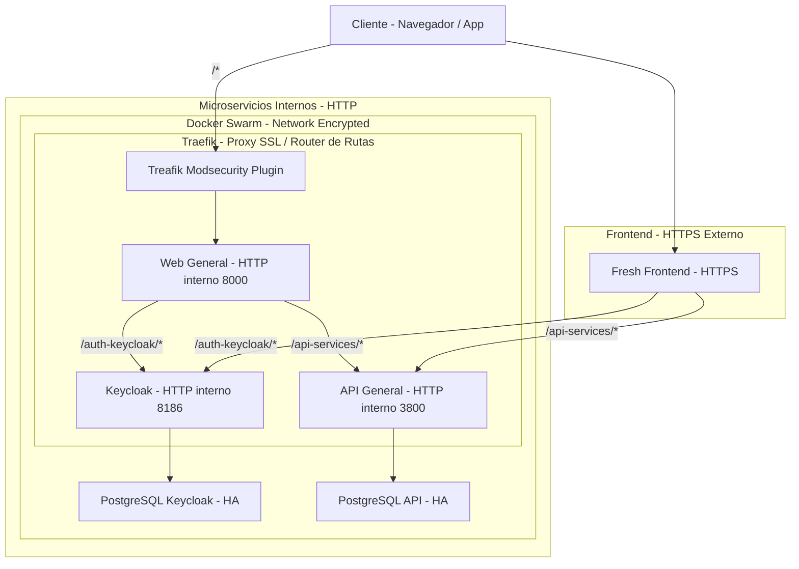

# Estcutura de Microservicios en Producción

En este articulo se explica como se unificara a producción los certificados SSL como la seguridad en web (OSWAP), desde todo lo necesario a interconectarse al cliente final.

Implementa todo el flujo aplicado del cliente a los microservicios relacionando el SSL externo como interno, y como se aplican la seguridad entre ellos.

<!-- truncate -->
