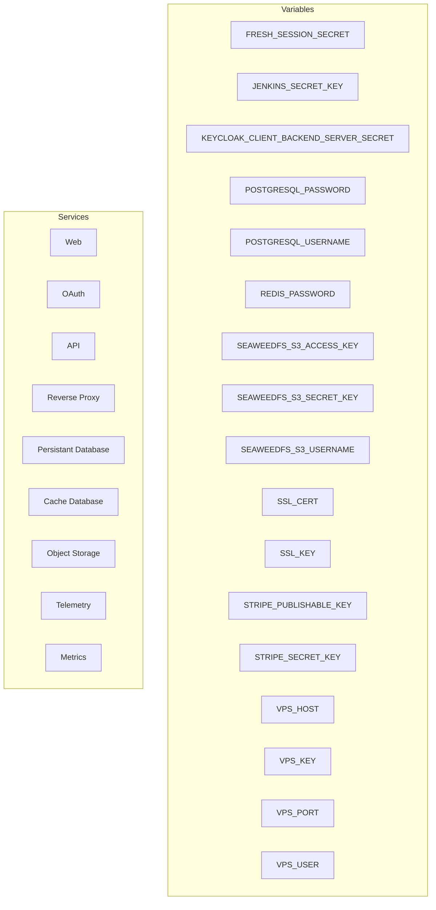

# Configuration Secrets

En este documento se explica de todos los secretos aplicados en el orquestador para que sirven con ejemplos para entender su utilidad final.

## Secrets:
- **FRESH_SESSION_SECRET**: Clave secreta de cifrado para las sesiones
- **JENKINS_SECRET_KEY**: Clave secreta para los agentes jenkins
- **KEYCLOAK_CLIENT_BACKEND_SERVER_SECRET**: Clave secreta del cliente sobre keycloak para úso del backend para los servicios externos
- **POSTGRESQL_PASSWORD**: Contraseña para el servidor PostgreSQL
- **POSTGRESQL_USERNAME**: Nombre usuario para el servidor PostgreSQL
- **REDIS_PASSWORD**: Contraseña para el servidor de Redis
- **SEAWEEDFS_S3_ACCESS_KEY**: Llave de acceso para el servicios S3 de SeaweedFS
- **SEAWEEDFS_S3_SECRET_KEY**: Llave secreta para el servicios S3 de SeaweedFS
- **SEAWEEDFS_S3_USERNAME**: Nombre usuario admin para el servicios S3 de SeaweedFS
- **SSL_CERT**: Certificado SSL ya compilado a producción
- **SSL_KEY**: Llave secreta para el SSL 
- **STRIPE_PUBLISHABLE_KEY**: Llave publicable del servicio de terceros sobre Stripe
- **STRIPE_SECRET_KEY**: Llave secreta del servicio de terceros sobre Stripe
- **VPS_HOST**: Nombre del host (dominio/ip) del VPS
- **VPS_KEY**: Llave secreta del VPS
- **VPS_PORT**: Número del puerto sobre el VPS
- **VPS_USER**: Nombre usuario del pc sobre el VPS

