# 🏗️ Flexible Order Flow over SQL Schemas

## Flujo FlexOrder del esquemas SQL
#### Flujo de pedidos flexible

```mermaid
erDiagram
    
    MERCHANT ||--o{ EMPLOYEE : "emplea"
    EMPLOYEE ||--o{ CLIENT : "atiende"
    
    CLIENT ||--o{ PRODUCT : "selecciona los productos"
    PRODUCT ||--o{ TRANSACTION : "verifica la transacción"

    TRANSACTION ||--o{ ORDER : "si realiza la transaccion exitosamente, realizará la creación del pedido"

    ORDER ||--o{ ORDER_PRODUCT : "luego de crear el pedido, se añaden todos los productos, y en el frontend calcula el total"
    ORDER_PRODUCT ||--o{ MERCHANT : "se guardará el pedido relacionado con los productos que el cliente compro"

    MERCHANT {
        string merchant_code PK "Código único del comerciante"
        string company_name "Nombre de la empresa"
        string email "Correo del comerciante"
    }
    CLIENT {
        string client_code PK "Código único del cliente"
        string email "Correo del cliente"
    }
    PRODUCT {
        string id PK "ID Único del producto"
        decimal amount "Coste del producto"
        string name "Nombre del producto"
        int stock "Stock disponible"
    }
    ORDER_PRODUCT {
        int order_id PK,FK "ID del pedido"
        int product_id PK,FK "ID del producto"
        int quantity "Cantidad comprada"
        decimal subtotal "Subtotal"
    }
    EMPLOYEE {
        string employee_id PK "ID del empleado"
        string merchant_code FK "Código del comerciante"
        string name "Nombre del empleado"
    }
    ORDER {
        string id PK "ID único del pedido"
        string transaction_id FK "ID de la transacción exitosa"
        string code "Código identificador único para finalizar el pedido"
        string status "Estado (ej. finished, pending)"
        datetime timestamp "Fecha y hora"
    }
    TRANSACTION {
        string id PK "ID único de la transacción"
        string merchant_code FK "Código del comerciante"
        string employee_id FK "ID del empleado"
        string client_code FK "ID del cliente"
        decimal amount "Monto"
        string currency "Moneda (ej. EUR)"
        datetime timestamp "Fecha y hora"
        string status "Estado (ej. successful, failed)"
        string checkout_reference "Referencia del pedido"
        string payment_method "Método de pago (ej. tarjeta, PayPal)"
    }
```

## Explicando el flujo usando el SaaS como Cliente

1. El dispositivo esta conectado y identificado por el negocio
2. Los clientes tienen acceso a la app
3. Los clientes seleccionan los productos que quieren pedir
4. Luego realiza la transacción
   - Si es existosa, se realiza la creación del pedido
   - Si no exitosa, no se realiza el pedido, re intentara la operación
5. El pedido llega al TPV del comerciante
6. El pedido se realiza, con todas los productos y se envia el pedido al email del cliente o se crea un tiquet al TPV, depende de como le guste al cliente
7. El cliente recibe sus productos
8. El camarero marca como completado el pedido

---
#### Author: Adría Martín Martorell - 22 de marzo del 2025 - 4:39AM