# PostgreSQL Tables

Este documento acredita a todas las tablas hechas y usadas p

## All Tables
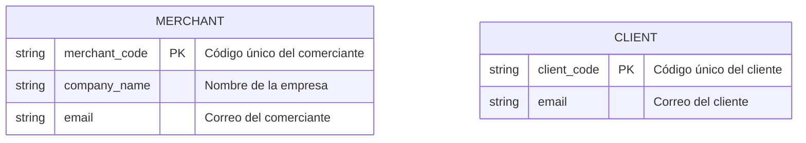
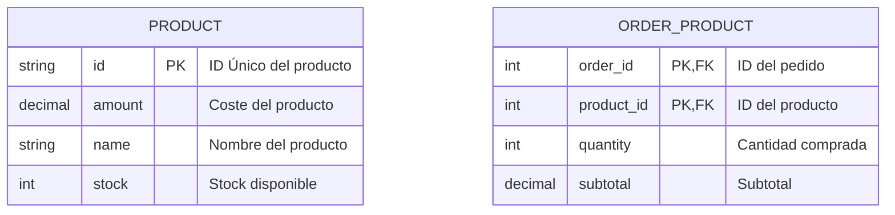
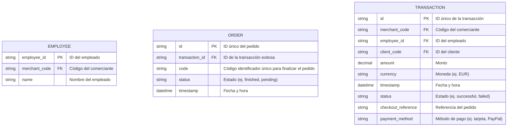

## Specific Tables

### Negocio
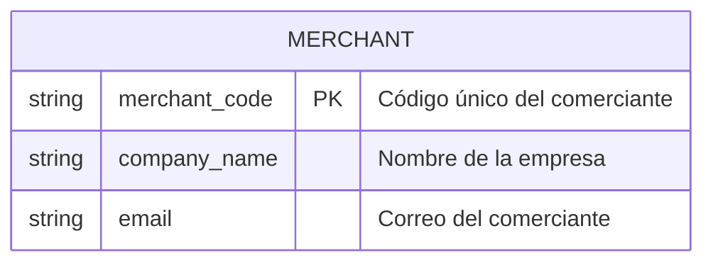

### Cliente
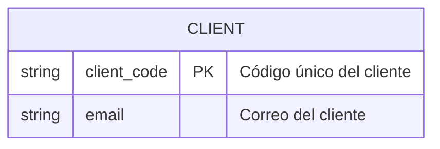

### Producto
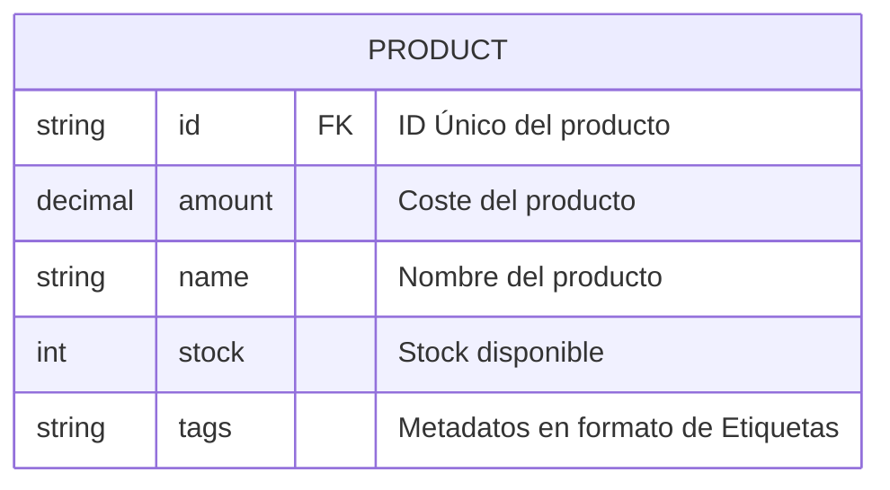

### Stock Producto
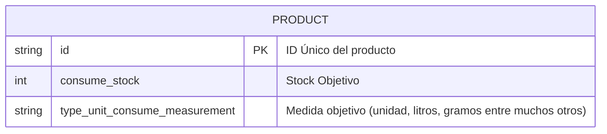

### Cantidad de producto referenciado al Pedido
El producto se referencia al pedido pero no debe de depender de lógica en el stock, ya que opera de forma variable durante el tiempo sin guardar el historial del stock.
La relacion es independiente al estado del stock
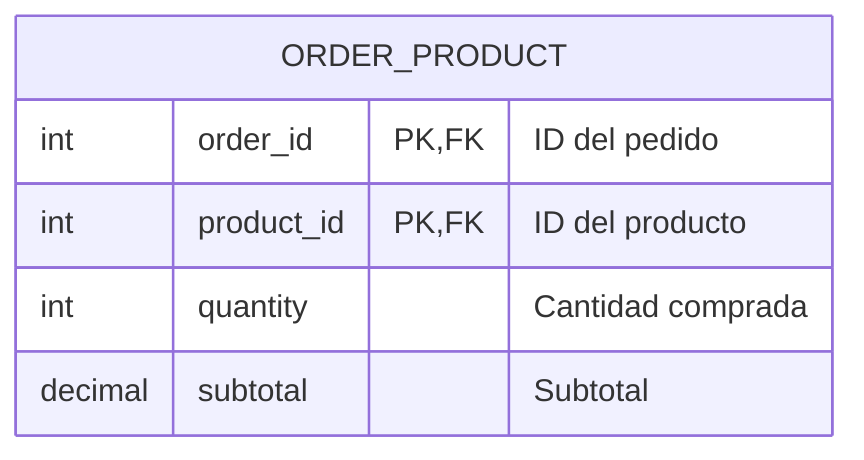

### Empleado
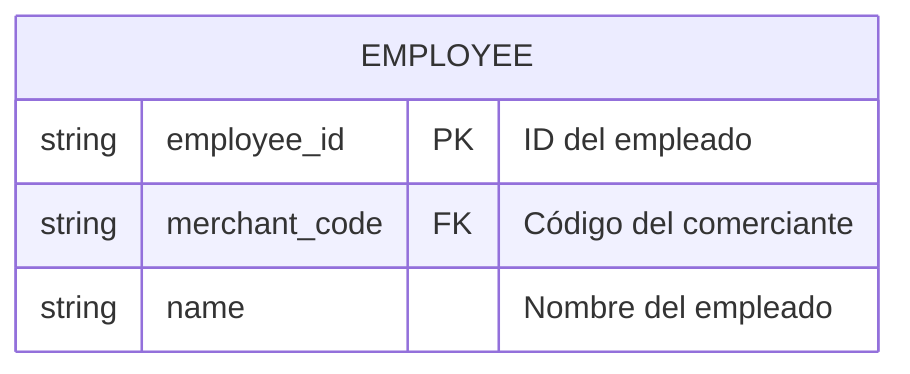

### Pedido
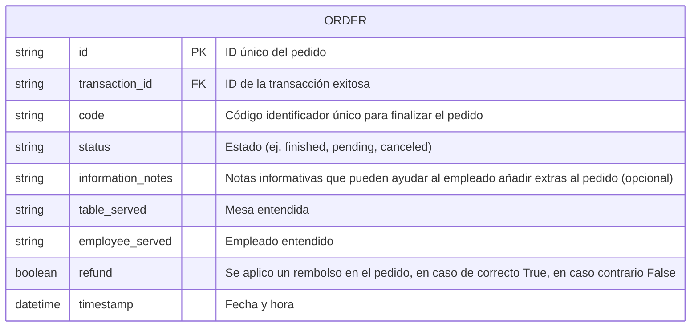

### Transacción
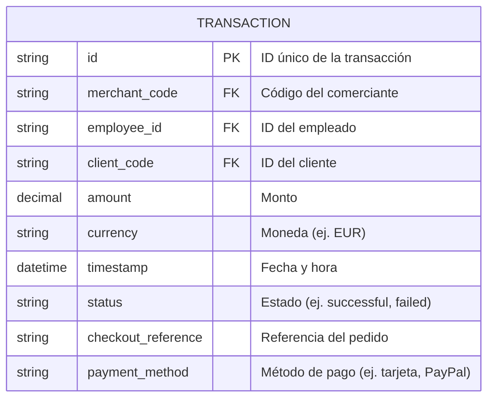

---
#### Author: Adría Martín Martorell - 22 de marzo del 2025 - 4:39AM