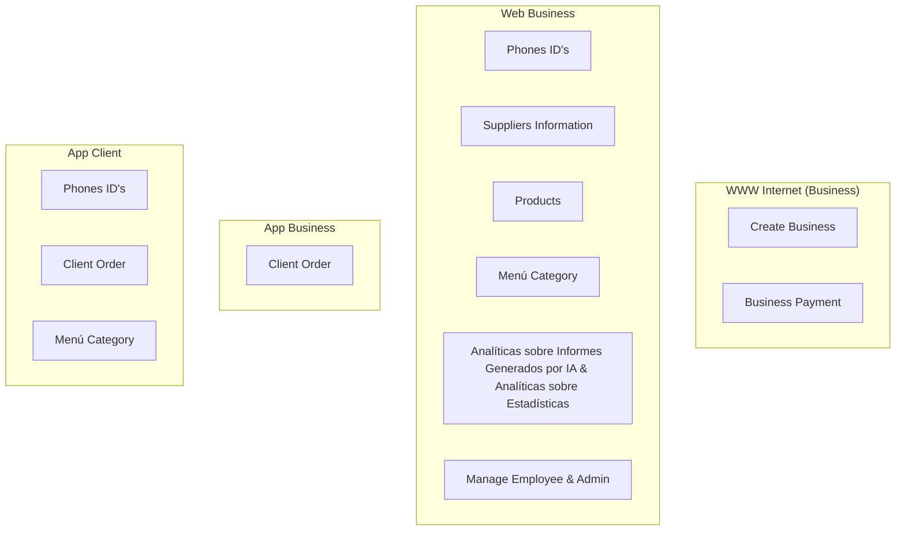

# 🟡 Database Platform relationated with Identities

En esta sección se aclara todas las identidades de la base de datos que se require para entender y aplicar todas las funciones de forma practica a través de sus propias plataformas que se úsan.

