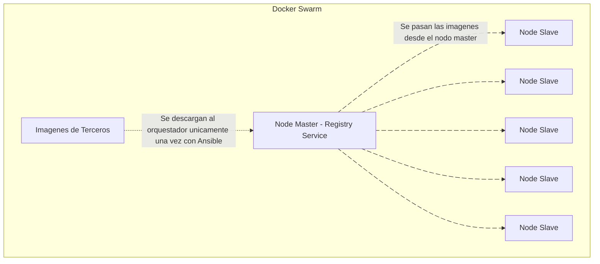

# Docker Swarm Registry

En este documento se explica como se usa y en que momento dado se aplica el registro de las imagenes de los contenedores a usarse posterioramente al orquestador.

El registro local entre el orquestador es un método de protección sobre corrupción, inexistentencia temporal/permanente de imagenes de terceros, que se usan para desarrollarse y poner en producción toda la suite empresarial.

#### Objetivo
Tener en un centro de servidores con un mismo orquestador liderando un servicio unificado local para proveer imagenes a todos los nodos escalvos.

Aquí se vería aun ejemplo practico:

### ¿Cuando aplicarse este servicio sobre el registro de imagenes?

Al realizar el MVP, es mas que suficiente por ahora gestionar imagenes de terceros por ahora, con actualizaciónes remotas de internet.

Pero a la hora de gestionar nodos esclavos sera mas que cirtico que los servicios no se den de baja, por no tener las imagenes.

Al comienzos del MVP, se aplicaran registros privados de imagenes de terceros por el nodo master. Hay que asegurar la existencia de las imagenes contra cualquier problema externo.

**20/10/2025**