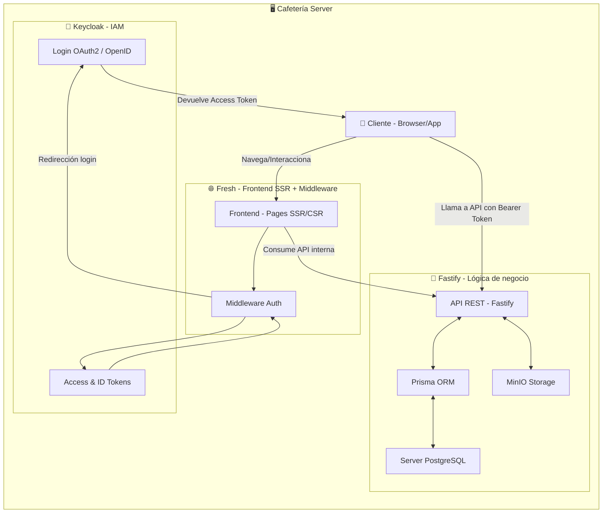

# 🟡 Page Client Auth Flow

```mermaid
graph LR;

    subgraph "🖥️ Cafetería Server"
    
        subgraph "🧠 Fastify - Lógica de negocio"
            FastifyAPI[API REST - Fastify]
            PrismaORM[Prisma ORM]
            PostgreSQL[Server PostgreSQL]
            MinIOStorage[MinIO Storage]
            
            FastifyAPI <--> PrismaORM
            FastifyAPI <--> MinIOStorage
            PrismaORM <--> PostgreSQL
        end

        subgraph "🌐 Fresh - Frontend SSR + Middleware"
            FreshPages[Frontend - Pages SSR/CSR]
            MiddlewareAuth[Middleware Auth]
            FreshPages --> MiddlewareAuth
        end

        subgraph "🔐 Keycloak - IAM"
            KeycloakLogin[Login OAuth2 / OpenID]
            TokenIssuer[Access & ID Tokens]
        end

        Client[📱 Cliente - Browser/App] -->|Navega/Interacciona| FreshPages

        MiddlewareAuth -->|Redirección login| KeycloakLogin
        KeycloakLogin -->|Devuelve Access Token| Client

        Client -->|Llama a API con Bearer Token| FastifyAPI
        
        FreshPages -->|Consume API interna| FastifyAPI

        MiddlewareAuth --> TokenIssuer
        TokenIssuer --> MiddlewareAuth

    end

```