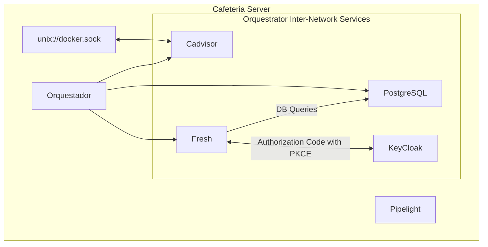

# 🟡 Backend Microservices Flow

```mermaid
graph TD;
    
    subgraph Cafeteria Server
        Pipelight
        URI_DOCKER[unix://docker.sock]
        URI_DOCKER <--> Cadvisor
        
        subgraph Orquestrator Inter-Network Services
            Backend[Fresh]
            PostgreSQL
            Cadvisor
            KeyCloak
        end

        Orquestador --> PostgreSQL
        Backend[Fresh] --> |DB Queries| PostgreSQL
        Orquestador --> Backend
        Orquestador --> Cadvisor
        Backend <--> |Authorization Code with PKCE| KeyCloak
    end
    
```