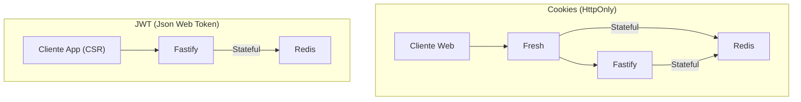
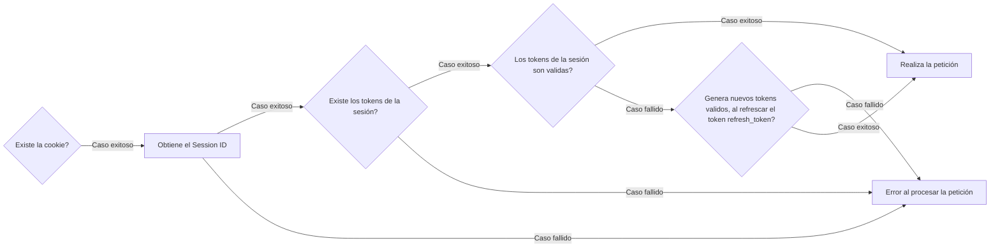
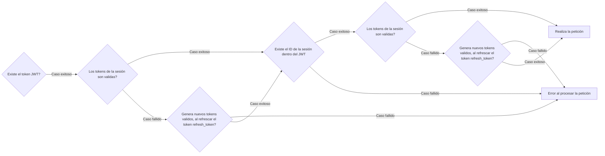

# 🟡 Backend Sessions

En esta sección se habla la gestión de sessiones con enfoque multipropoito, explicando la unificación de las mismas sesiones y el tipo que se utilizan en cada tipo de plataforma.

## Tipo de sesión global
#### - Stateful (con Redis como base de datos caché)

### Sesión por Cookies
- **Encriptación**: HMAC-SHA256 + AES-CGM
- **Clave Secreta**
- **Nombre de la Cookie**
- **Prefijo de la Sesión**

### Sesión por JWT
- **Encriptación**: RS256 (JWT)
- **Clave Secreta**
- **Data**:
  - session_id

## Unificación de sesiones multiproposito

---

## Validación de sesiones

Aclarar una cosa, al tener las sesiones de forma stateful, tendríamos las sesiones de forma sincornizada a la hora de gaurdar los tokens, tendríamos mas facilidad de refrescar los tokens de forma fiable y centralizada.

Si tuveriamos que hacer un refresh, centralizaríamos desde la refrencia del session id, dentro refrescariamos o eliminariamos todo lo necesario de los tokens.

### Por cookies
##### Pasos:
1. Verifica si tiene la cookie
2. Si la tiene, obtiene su session id
3. De la session intentara extraer los tokens
4. Validará los tokens
5. Si fué exitoso la validación, realizara la petición

##### Flujo de autenticación

### Por JWT
##### Pasos:
1. Verifica la validación del JWT
2. Si fúe exitoso, obtiene el session id
3. Realiza la petición entrante

##### Flujo de autenticación
