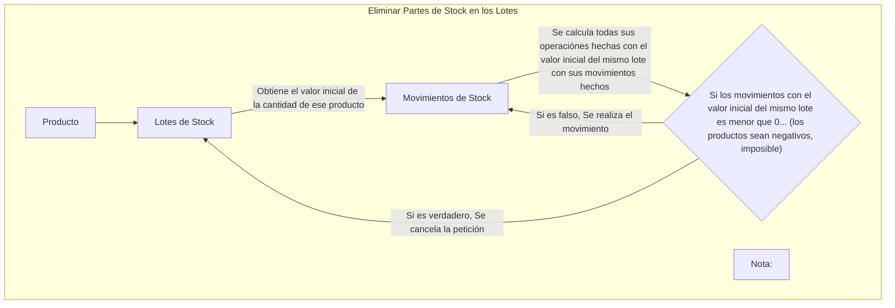
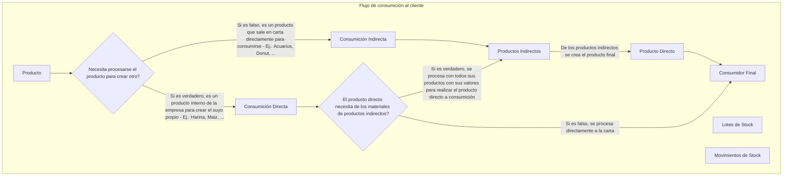

# Inventory Logic Stock

En esta sección se explica como se maneja la lógica del stock de todo el negocio resumido en un grafo, desde la validación de movimientos hasta operaciónes mas complejas.


**La logica del almacén sera centralizada desde la API de Fastify**, para evitar fallos realizados en Frontend, y mas seguridad en peticiónes obtención de información


### Consumición de los productos en lotes


Para eivtar stock directamente usado en el usuario final, tenemos un separador para dividir la consumición directa como indirecta.


## Flujo de consumición al cliente



En este caso de manejo complejo de obtención de datos junto con su manejo inefectivo de la centralización de datos, hay que aplicarse facilmente en rutas del API.

Tenemos que evitar centralizar lógica en la web de Fresh, y hacer que toda la lógica se centralize para usarlo en futuro en App's nativas como en Web's separadas y independientes.

En caso hay que contar con varias rutas:

- **Obtención de información**:
  
  - Obtención de todos los productos directos/indirectos calculados por todos los grupos de ajustamiento de precios directamente al consumidor final, en paginación por menus.
    - **GET** `/stock/product/consumer`: `?skip=0&take=0` or `?productId=""`
    - Nota:
      - No se obtiene el producto de inventario ya que es un producto que se crean productos indirectos/directos para el consumidor final.
      - En la lógica del negocio es estricto usarse redondeos para cifras de precios estrictas y fiables, por decimales.
    - **Pasos**:
      1. Verifica si la petición quiere paginación o obtener a un producto en especifico:
         1. Si quiere paginación, obtiene la paginación de los productos (incluy. las id's de los menus)  (seccionados en la UI por menus)
         2. Si quiere obtener un producto en especifico, obtiene un producto
      2. Obtiene la siguiente información aplicada a la respuesta del/de los producto/s:
         - El timeZone a nivel internacional
         - Todos sus productos (Habiendo limitado por cierta cantidad de productos por menú)
         - Grupos sobre ajustamientos de precios por productos
         - Grupos sobre ajustamientos de precios por menús
         - Grupos sobre ajustamientos de precios por categorías de menus
      3. Itera cada grupo de ajustamiento de precios, por cada uno de las categorias a aplicarse por cada producto si es necesario. (Se aplican directamente en el precio, para evitar fallos en la UI).
      4. De todos los menus que abarcan los productos, se obtienen su horario si tienen
         1. Si tienen horario:
            1. Se ajusta las horas con el timeZone
      5. Respuesta estandarizada para la aplicación directa en UI

  - 

- **Procesamiento gestión de stock**
  - Procesa la reducción del producto indirecto/directo
    - **POST** `/stock/product/consume`
    - **Request JSON**
      ```typescript
      enum TypeBusinessProductStockGroupMovment {
         CONSUMER
         WAREHOUSE
      }
      
      interface Data {
         productId: string;
         quantity?: number;
         type: TypeBusinessStockGroupMovment;
      }
      ```
    - Nota:
      - Si un producto indirecto no tiene suficientes materiales de los productos internos, no se realizara el consumo y se esperará un error
      - Se junta por grupos de movimientos de stock en su conjunto a través de usando $transaction para cualquier tipo de cambio agrupado y fiable a aplicarse.
    - **Pasos**:
        1. Verifica **si existe el producto**
        2. Verifica que **no es un producto de inventario**
        3. **Itera por la cantidad de productos**, antes de hacer cualquier modificación se verifica si es posible:
           1. **Verifica si es un producto directo/indirecto**
              1. **Si es directo**:
                 1. **Itera los lotes del producto disponibles** por orden de la fecha de expiración recientes a expirar:
                    1. **Obtiene el lote especifico de los productos**
                       1. Si el lote del conteo orginial de productos, **no es suficiente para consumirse**:
                          1. **Busca en otros lotes**, contando en positivo los productos hasta que encuentre varios lotes que se puedan consumir conjuntamente (porque un lote no es suficiente)
                          2. **Si no puede**, realiza un error por no poder consumirse, por falta de materiales a crear por varios lotes, porque el lote a usarse no es suficiente para consumirse
                       2. Si el lote **es suficiente para conusmirse**:
                          1. Realiza la operación de la consumición con una respuesta exitosa, por la consumición
               2. **Si es indirecto**:
                  1. Verifica que **existen todos los productos del inventario**
                  2. **Itera por cada lote del producto del inventario** por el orden FEFO, por su consumición individual:
                     1. **Obtiene el lote especifico de los productos**
                        1. Si el lote del conteo orginial de productos, **no es suficiente para consumirse**:
                             1. **Busca en otros lotes**, contando en positivo los productos hasta que encuentre varios lotes que se puedan consumir conjuntamente (porque un lote no es suficiente)
                             2. **Si no puede**, realiza un error por no poder consumirse, por falta de materiales a crear por varios lotes, porque el lote a usarse no es suficiente para consumirse
                        2. Si el lote **es suficiente para conusmirse**:
                              1. Realiza la operación de la consumición con una respuesta exitosa, por la consumición
                  3. **Se guardan los lotes con las operaciones directamente a MOVIMIENTOS DE LOTES SOBRE STOCK** en cada uno de los productos del inventario
                  4. Devuelve el **resultado exitoso** de la operación

  - Revierte el cambio realizado del procesamiento de la consumición
   - **POST** `/stock/product/consume/undo`
  - **Request JSON**
    ```typescript
    interface Data {
       groupMovmentId: string;
    }
    ```

#### Porque existen tipos de consumidores a reducir el stock?
Porque los mismos empleados no podran realizar ningún tipo de reducción de stock solo unicamente rembolsos de los clientes en sus pedidos realizados, mientras que en la plataforma web, es donde

### Autodefiniciónes
- **Producto Interno**: Producto interno de la empresa para usarse en productos indirectos
- **Producto Indirecto**: Producto que necesita verificar la existencia de los productos internos de la empresa para reducir el stock.
- **Producto Directo**: Producto que se reduce su propio stock.