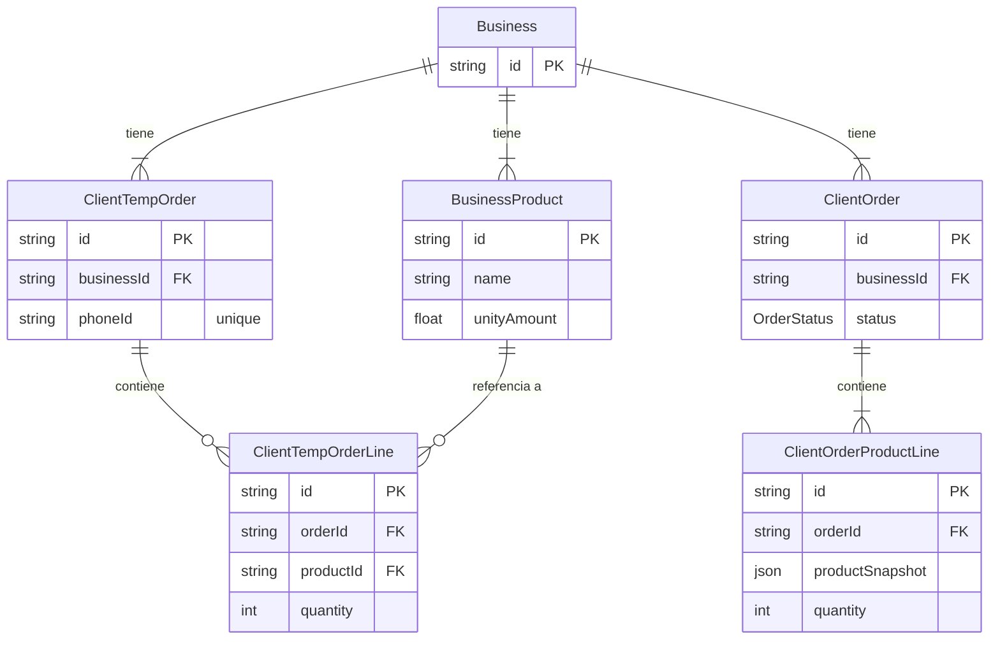

# 🟡 Relación de Pedidos Temporales

Este diagrama muestra la relación entre los modelos involucrados en la creación de pedidos temporales, como `ClientTempOrder`, `ClientTempOrderLine`, `BusinessProduct` y `BusinessOrderUbication`.

