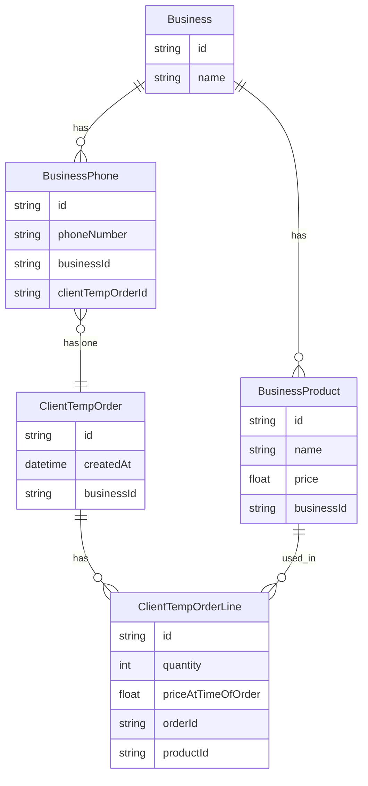

# Business Logic Temporal Client Orders

```mermaid
erDiagram

  Business ||--o{ BusinessPhone : has
  Business ||--o{ BusinessProduct : has

  BusinessPhone }o--|| ClientTempOrder : "has one"
  ClientTempOrder ||--o{ ClientTempOrderLine : has
  BusinessProduct ||--o{ ClientTempOrderLine : used_in

  Business {
    string id
    string name
  }

  BusinessPhone {
    string id
    string phoneNumber
    string businessId
    string clientTempOrderId
  }

  BusinessProduct {
    string id
    string name
    float price
    string businessId
  }

  ClientTempOrder {
    string id
    datetime createdAt
    string businessId
  }

  ClientTempOrderLine {
    string id
    int quantity
    float priceAtTimeOfOrder
    string orderId
    string productId
  }
```
