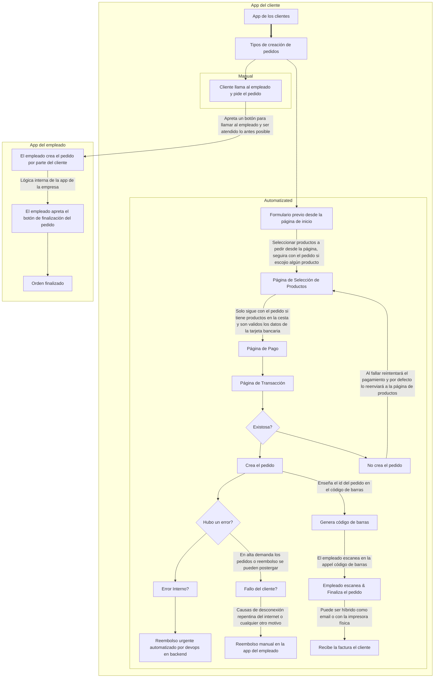

# 🟡 Order Flow App Client Logic

En esta sección explica los flujos de pedidos a través que maneja la app del cliente al resultado final para evitar incoherencias o redundancias del mismo sistema en otras plataformas. Se explica todas las funciones creadas relacionadas en el flujo que se hace para los pedidos.

