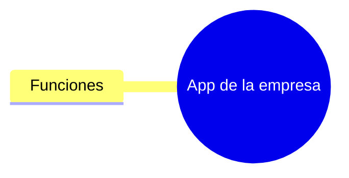
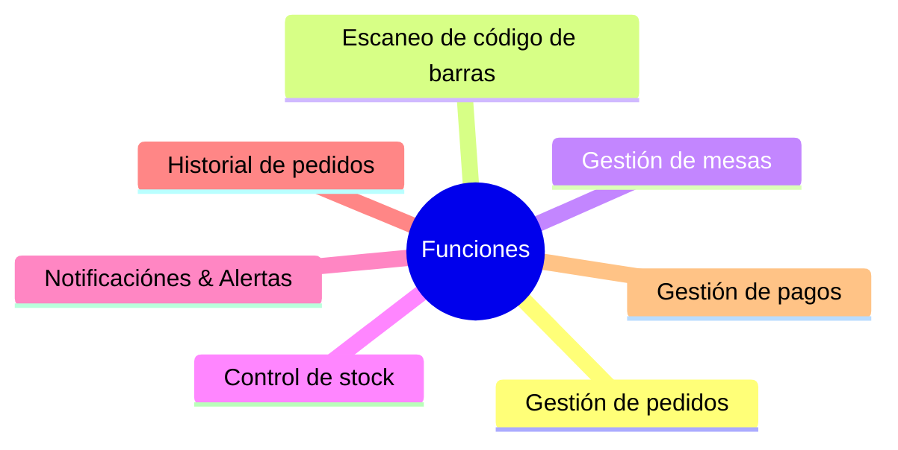
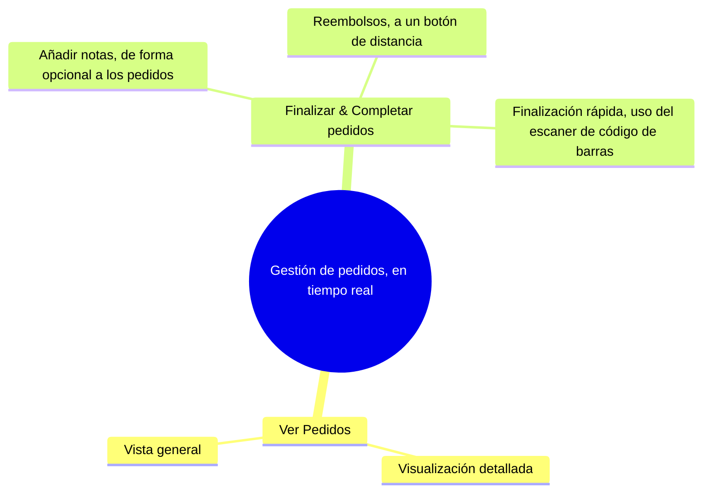
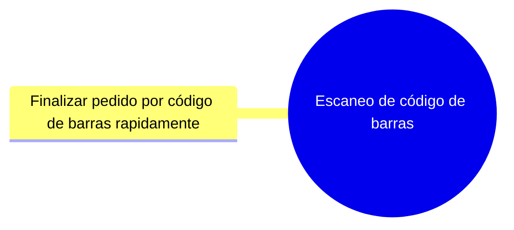
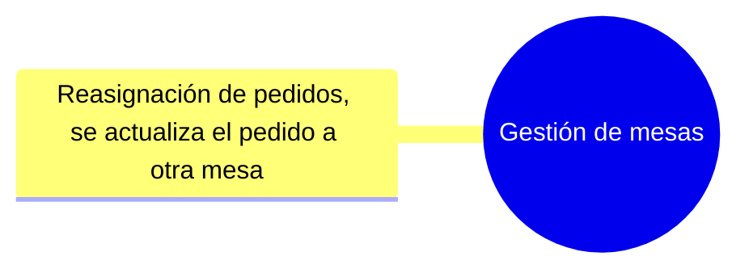
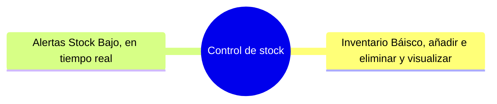
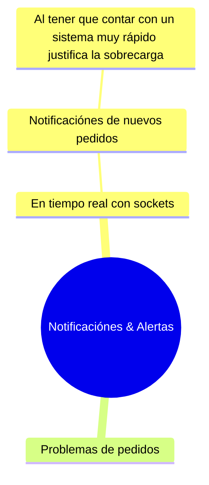
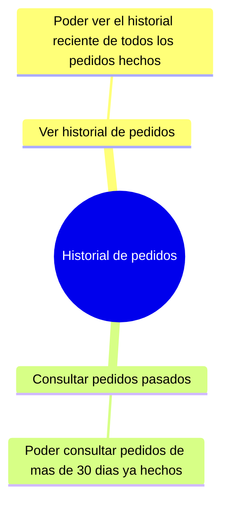
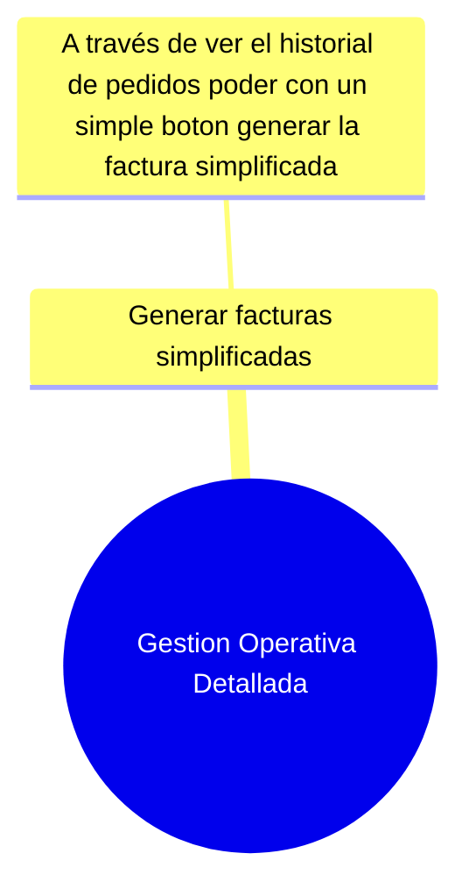

# 🔵 App Business Logic Development

En esta sección explica todas las funciones de la app de la empresa simplificado y seccionando para visualizarse en una forma sencilla en las funciones de cada tipo de grupo de funciones generales que debe de tener la app.

--- 

### Funciones de la Web

--- 

### Gestión de pedidos

--- 

### Escaneo de código de barras

--- 

### Gestión de mesas

--- 

### Control de stock

--- 

### Notificaciónes & Alertas

--- 

### Historial de pedidos

--- 

### Gestión de pagos

**Author: Adrià Martín, 4 may 12:01**