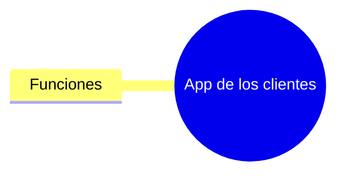
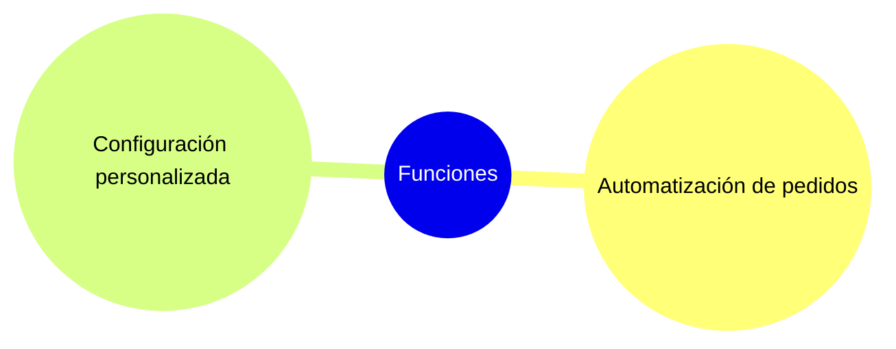
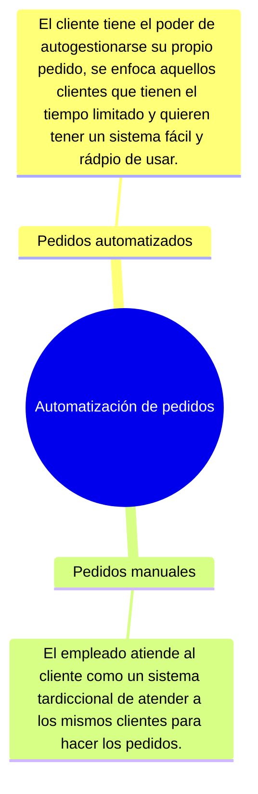
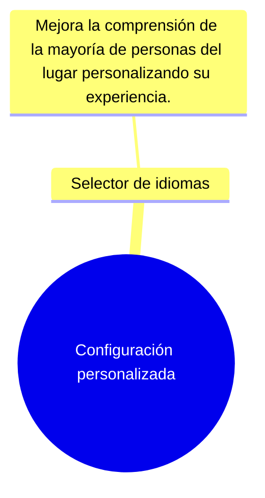

# 🟡 App Client Logic Development

```mermaid
mindmap
    root((App de los clientes))
        Funciones

```

--- 

### Funciones de la Web

```mermaid
mindmap
        root((Funciones))
            ((Automatización de pedidos))

            ((Configuración personalizada))

```

--- 

### Automatización de pedidos

```mermaid
mindmap
    root((Automatización de pedidos))
        Pedidos automatizados
            El cliente tiene el poder de autogestionarse su propio pedido, se enfoca aquellos clientes que tienen el tiempo limitado y quieren tener un sistema fácil y rádpio de usar.
        Pedidos manuales
            El empleado atiende al cliente como un sistema tardiccional de atender a los mismos clientes para hacer los pedidos.

```

--- 

### Configuración personalizada

```mermaid
mindmap
    root((Configuración personalizada))
        Selector de idiomas
            Mejora la comprensión de la mayoría de personas del lugar personalizando su experiencia.

```