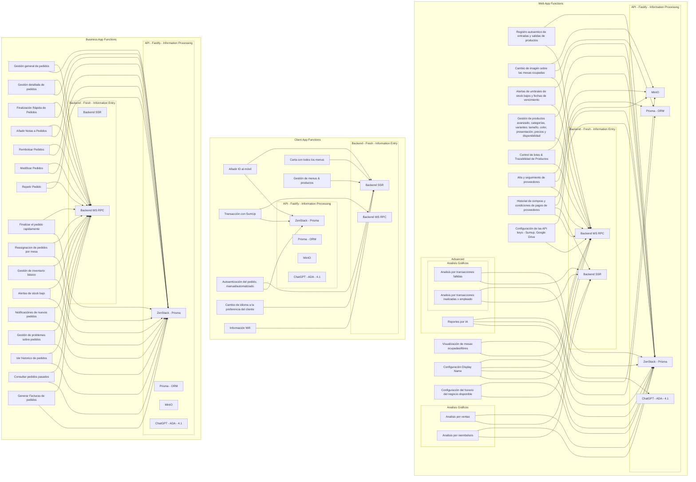

# 🟡 Business Functions relationated Backend Flow

Si las funciones necesitan Auth, se le pone como comentario relacionado directamente con la flecha, como en el Backend SSR o en la API (ws).

```mermaid
flowchart TB

    subgraph Web App Functions
        subgraph API_Fastify_Business_Web_App[API - Fastify - Information Processing]
            APIZenStack_Business_Web_App[ZenStack - Prisma]
            APIPrisma_Business_Web_App[Prisma - ORM]
            APIMinIO_Business_Web_App[MinIO]
            APIOpenAIChatGPT_Business_Web_App[ChatGPT - ADA - 4.1]
            
        end

        subgraph Backend_Fresh_Business_Web_App[Backend - Fresh - Information Entry]
            BackendDirectSSR_Business_Web_App[Backend SSR]
            BackendWsRpc_Business_Web_App[Backend WS RPC]
        end
        
        BusinessWebAppFunTablesVisualize[Visualización de mesas ocupadas/libres]
        BusinessWebAppFunTablesVisualize --> BackendWsRpc_Business_Web_App
        BusinessWebAppFunTablesVisualize ----> APIZenStack_Business_Web_App

        BusinessWebAppFunAutomaticRecordingOfProductInputsAndOutputs[Registro autoamtico de entradas y salidas de productos]
        BusinessWebAppFunAutomaticRecordingOfProductInputsAndOutputs --> BackendWsRpc_Business_Web_App
        BusinessWebAppFunAutomaticRecordingOfProductInputsAndOutputs --> APIZenStack_Business_Web_App

        BusinessWebAppFunChangePhotoViewTables[Cambio de imagén sobre las mesas ocupadas]
        BusinessWebAppFunChangePhotoViewTables --> BackendWsRpc_Business_Web_App
        BusinessWebAppFunChangePhotoViewTables --> APIPrisma_Business_Web_App
        BusinessWebAppFunChangePhotoViewTables --> APIMinIO_Business_Web_App

        BusinessWebAppFunAlertsForLowStockThresholdsAndExpirationDates[Alertas de umbrales de stock bajos y fechas de vencimiento]
        BusinessWebAppFunAlertsForLowStockThresholdsAndExpirationDates --> BackendWsRpc_Business_Web_App
        BusinessWebAppFunAlertsForLowStockThresholdsAndExpirationDates ---> APIZenStack_Business_Web_App


        BusinessWebAppFunAdvancedProductsManager[Gestión de productos avanzado, categorías, variantes: tamaño, color, presentación; precios y disponibilidad]
        BusinessWebAppFunAdvancedProductsManager --> BackendWsRpc_Business_Web_App
        BusinessWebAppFunAdvancedProductsManager ---> APIZenStack_Business_Web_App

        BusinessWebAppFunBatchControlAndTraceability[Control de lotes & Trazabilidad de Productos]
        BusinessWebAppFunBatchControlAndTraceability --> BackendWsRpc_Business_Web_App
        BusinessWebAppFunBatchControlAndTraceability ---> APIZenStack_Business_Web_App


        BusinessWebAppFunSupplierRegistrationAndMonitoring[Alta y seguimiento de proveedores]
        BusinessWebAppFunSupplierRegistrationAndMonitoring --> BackendWsRpc_Business_Web_App
        BusinessWebAppFunSupplierRegistrationAndMonitoring ---> APIPrisma_Business_Web_App
        BusinessWebAppFunSupplierRegistrationAndMonitoring ---> APIMinIO_Business_Web_App

        BusinessWebAppFunPurchaseHistoryAndPaymentTermsOfSuppliers[Historial de compras y condiciones de pagos de proveedores]
        BusinessWebAppFunPurchaseHistoryAndPaymentTermsOfSuppliers --> BackendWsRpc_Business_Web_App
        BusinessWebAppFunPurchaseHistoryAndPaymentTermsOfSuppliers --> BackendDirectSSR_Business_Web_App
        BusinessWebAppFunPurchaseHistoryAndPaymentTermsOfSuppliers --> APIZenStack_Business_Web_App
        BusinessWebAppFunPurchaseHistoryAndPaymentTermsOfSuppliers ---> APIMinIO_Business_Web_App
        

        BusinessWebAppFunConfigDisplayName[Configuración Display Name]
        BusinessWebAppFunConfigDisplayName --> BackendWsRpc_Business_Web_App
        BusinessWebAppFunConfigDisplayName ---> APIZenStack_Business_Web_App

        BusinessWebAppFunConfigSchedule[Configuración del horario del negocio disponible]
        BusinessWebAppFunConfigSchedule --> BackendWsRpc_Business_Web_App
        BusinessWebAppFunConfigSchedule ----> APIZenStack_Business_Web_App

        BusinessWebAppFunConfigApiKeys[Configuración de las API keys - Sumup, Google Drive]
        BusinessWebAppFunConfigApiKeys --> BackendWsRpc_Business_Web_App
        BusinessWebAppFunConfigApiKeys ---> APIZenStack_Business_Web_App

        BusinessWebAppFunConfigDisplayName[Configuración Display Name]
        BusinessWebAppFunConfigDisplayName --> BackendWsRpc_Business_Web_App
        BusinessWebAppFunConfigDisplayName ----> APIZenStack_Business_Web_App

        subgraph BusinessWebAppFunAnalisis[Analisis Gráficos]
            BusinessWebAppFunAnalisisMehtodSales[Analisis por ventas]
            BusinessWebAppFunAnalisisMehtodSales --> BackendDirectSSR_Business_Web_App
            BusinessWebAppFunAnalisisMehtodSales --> APIZenStack_Business_Web_App

            BusinessWebAppFunAnalisisMehtodRefunds[Analisis por reembolsos]
            BusinessWebAppFunAnalisisMehtodRefunds --> BackendDirectSSR_Business_Web_App
            BusinessWebAppFunAnalisisMehtodRefunds ----> APIZenStack_Business_Web_App
        end
        
        subgraph Web App Advanced[Advanced]
            direction LR
            BusinessWebAppFunAdvancedIAReports[Reportes por IA]
            BusinessWebAppFunAdvancedIAReports --> APIPrisma_Business_Web_App
            BusinessWebAppFunAdvancedIAReports --> APIMinIO_Business_Web_App
            BusinessWebAppFunAdvancedIAReports ----> APIOpenAIChatGPT_Business_Web_App

            subgraph BusinessWebAppFunAdvancedAnalisis[Analisis Gráficos]
                BusinessWebAppAdvancedFunAnalisisMehtodFailedTransactions[Analisis por transacciones fallidas]
                BusinessWebAppAdvancedFunAnalisisMehtodFailedTransactions --> BackendDirectSSR_Business_Web_App
                BusinessWebAppAdvancedFunAnalisisMehtodFailedTransactions --> APIZenStack_Business_Web_App
                
                BusinessWebAppAdvancedFunAnalisisMehtodEmployeeTransactions[Analisis por transacciones realizadas x empleado]
                BusinessWebAppAdvancedFunAnalisisMehtodEmployeeTransactions --> BackendDirectSSR_Business_Web_App
                BusinessWebAppAdvancedFunAnalisisMehtodEmployeeTransactions ----> APIZenStack_Business_Web_App
            end
        end
        
    end

    subgraph Client App Functions

        subgraph API_Fastify_Client_App_App[API - Fastify - Information Processing]
            APIZenStack_Client_App_App[ZenStack - Prisma]
            APIPrisma_Client_App_App[Prisma - ORM]
            APIMinIO_Client_App_App[MinIO]
            APIOpenAIChatGPT_Client_App_App[ChatGPT - ADA - 4.1]
            
        end

        subgraph Backend_Fresh_Client_App_App[Backend - Fresh - Information Entry]
            BackendDirectSSR_Client_App_App[Backend SSR]
            BackendWsRpc_Client_App_App[Backend WS RPC]
        end


        BusinessClientAppFunBusinessID[Añadir ID al móvil]
        BusinessClientAppFunBusinessID ---> BackendDirectSSR_Client_App_App
        BusinessClientAppFunBusinessID --> APIZenStack_Client_App_App

        BusinessClientAppFunTransaction[Transacción con SumUp]
        BusinessClientAppFunTransaction ---> BackendWsRpc_Client_App_App
        BusinessClientAppFunTransaction --> APIZenStack_Client_App_App


        BusinessClientAppFunTypeAutomatizationOrder[Autoamtización del pedido, manual/automatizado]
        BusinessClientAppFunTypeAutomatizationOrder ---> BackendDirectSSR_Client_App_App
        BusinessClientAppFunTypeAutomatizationOrder --> APIZenStack_Client_App_App

        BusinessClientAppFunLang[Cambio de idioma a la preferencia del cliente]
        BusinessClientAppFunLang ---> BackendDirectSSR_Client_App_App

        BusinessClientAppFunWifi[Información Wifi]
        BusinessClientAppFunWifi ---> BackendDirectSSR_Client_App_App

        BusinessClientAppFunMenu[Carta con todos los menus]
        BusinessClientAppFunMenu --> BackendDirectSSR_Client_App_App

        BusinessClientAppFunObtainMenus[Gestión de menus & productos]
        BusinessClientAppFunObtainMenus --> BackendDirectSSR_Client_App_App
    end

    subgraph Business App Functions

        subgraph API_Fastify_Business_App_App[API - Fastify - Information Processing]
            APIZenStack_Business_App_App[ZenStack - Prisma]
            APIPrisma_Business_App_App[Prisma - ORM]
            APIMinIO_Business_App_App[MinIO]
            APIOpenAIChatGPT_Business_App_App[ChatGPT - ADA - 4.1]
            
        end

        subgraph Backend_Fresh_Business_App_App[Backend - Fresh - Information Entry]
            BackendDirectSSR_Business_App_App[Backend SSR]
            BackendWsRpc_Business_App_App[Backend WS RPC]
        end
        
        
        BusinessAppFunOrderGeneralManager[Gestión general de pedidos]
        BusinessAppFunOrderGeneralManager --> BackendWsRpc_Business_App_App
        BusinessAppFunOrderGeneralManager ----> APIZenStack_Business_App_App

        BusinessAppFunOrderDetailedManager[Gestión detallada de pedidos]
        BusinessAppFunOrderDetailedManager --> BackendWsRpc_Business_App_App
        BusinessAppFunOrderDetailedManager ----> APIZenStack_Business_App_App

        BusinessAppFunFastFinalizeOrder[Finalización Rápida de Pedidos]
        BusinessAppFunFastFinalizeOrder --> BackendWsRpc_Business_App_App
        BusinessAppFunFastFinalizeOrder ----> APIZenStack_Business_App_App

        BusinessAppFunNotesOrder[Añadir Notas a Pedidos]
        BusinessAppFunNotesOrder --> BackendWsRpc_Business_App_App
        BusinessAppFunNotesOrder ----> APIZenStack_Business_App_App

        BusinessAppFunOrderRefound[Rembolsar Pedidos]
        BusinessAppFunOrderRefound --> BackendWsRpc_Business_App_App
        BusinessAppFunOrderRefound ----> APIZenStack_Business_App_App

        BusinessAppFunModifyOrder[Modificar Pedidos]
        BusinessAppFunModifyOrder --> BackendWsRpc_Business_App_App
        BusinessAppFunModifyOrder ----> APIZenStack_Business_App_App

        BusinessAppFunRepeatOrder[Repetir Pedido]
        BusinessAppFunRepeatOrder --> BackendWsRpc_Business_App_App
        BusinessAppFunRepeatOrder ----> APIZenStack_Business_App_App

        BusinessAppFunFinalizeBarcodeScannOrder[Finalizar el pedido rapidamente]
        BusinessAppFunFinalizeBarcodeScannOrder --> BackendWsRpc_Business_App_App
        BusinessAppFunFinalizeBarcodeScannOrder ----> APIZenStack_Business_App_App

        BusinessAppFunReassignmentOfOrdersByTable[Reasignacion de pedidos por mesa]
        BusinessAppFunReassignmentOfOrdersByTable --> BackendWsRpc_Business_App_App
        BusinessAppFunReassignmentOfOrdersByTable ----> APIZenStack_Business_App_App

        BusinessAppFunBasicInventory[Gestión de inventario básico]
        BusinessAppFunBasicInventory --> BackendWsRpc_Business_App_App
        BusinessAppFunBasicInventory ----> APIZenStack_Business_App_App

        BusinessAppFunLowStockAlerts[Alertas de stock bajo]
        BusinessAppFunLowStockAlerts --> BackendWsRpc_Business_App_App
        BusinessAppFunLowStockAlerts ----> APIZenStack_Business_App_App

        BusinessAppFunNewOrdersNotifications[Notificaciónes de nuevos pedidos]
        BusinessAppFunNewOrdersNotifications --> BackendWsRpc_Business_App_App
        BusinessAppFunNewOrdersNotifications ----> APIZenStack_Business_App_App

        BusinessAppFunManageOrderProblems[Gestión de problemas sobre pedidos]
        BusinessAppFunManageOrderProblems --> BackendWsRpc_Business_App_App
        BusinessAppFunManageOrderProblems ----> APIZenStack_Business_App_App

        BusinessAppFunViewOrderHistory[Ver historico de pedidos]
        BusinessAppFunViewOrderHistory --> BackendWsRpc_Business_App_App
        BusinessAppFunViewOrderHistory ----> APIZenStack_Business_App_App
        
        BusinessAppFunCheckPastOrders[Consultar pedidos pasados]
        BusinessAppFunCheckPastOrders --> BackendWsRpc_Business_App_App
        BusinessAppFunCheckPastOrders ----> APIZenStack_Business_App_App
        
        BusinessAppFunPaymentManagment[Generar Facturas de pedidos]
        BusinessAppFunPaymentManagment --> BackendWsRpc_Business_App_App
        BusinessAppFunPaymentManagment ----> APIZenStack_Business_App_App
    end

```

