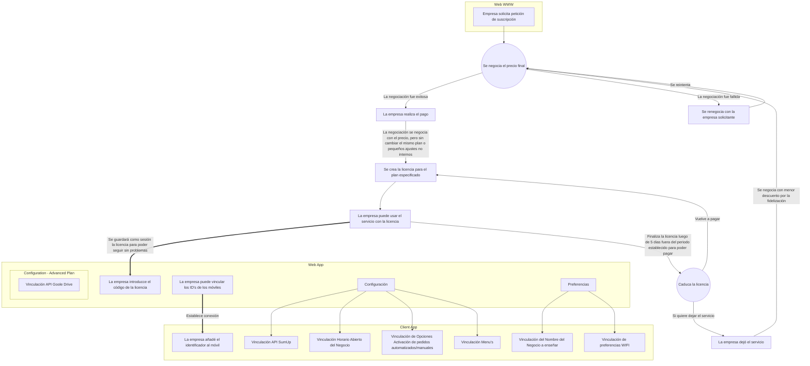

# 🟡 Business Register Flow

```mermaid
flowchart TB

    subgraph Web WWW
        BusinessSendReq[Empresa solicita petición de suscripción]
    end

    subgraph Web App
    direction TB
        BusinessEnterLicense[La empresa introducce el código de la licencia]
        BusinessLinkID[La empresa puede vincular los ID's de los móviles]
        subgraph Configuration - Advanced Plan
            BusinessLinkApiDrive[Vinculación API Goole Drive]
        end
        
        BusinessConfiguration[Configuración]
        BusinessPreferences[Preferencias]
    end

    

    subgraph Client App
        direction TB
        ClientAppLinkBusinessID[La empresa añadé el identificador al móvil]
        ClientAppLinkApiKeySumUp[Vinculación API SumUp]
        ClientAppLinkDisplayName[Vinculación del Nombre del Negocio a enseñar]
        ClientAppLinkOpenSchedule[Vinculación Horario Abierto del Negocio]
        ClientAppLinkActivateOrderOptions[Vinculación de Opciones Activación de pedidos automatizados/manuales]
        ClientAppLinkWifiOptions[Vinculación de preferencias WIFI]
        ClientAppLinkMenus[Vinculación Menu's]
    end

    BusinessAttemptNegotiatePrice((Se negocia el precio final))
    BusinessPaymentRegistrated[La empresa realiza el pago]
    BusinessAttemptFailed[Se renegocia con la empresa solicitante]
    BusinessCreateLicense[Se crea la licencia para el plan especificado]
    BusinessAccessLicense[La empresa puede usar el servicio con la licencia]
    BusinessAccessLicenseEnd((Caduca la licencia))
    BusinessEndService[La empresa dejó el servicio]

    BusinessSendReq --> BusinessAttemptNegotiatePrice
    BusinessAttemptNegotiatePrice --> |La negociación fue exitosa| BusinessPaymentRegistrated
    BusinessAttemptNegotiatePrice --> |La negociación fue fallida| BusinessAttemptFailed
    BusinessAttemptFailed --> |Se reintenta| BusinessAttemptNegotiatePrice
    BusinessPaymentRegistrated --> |La negociación se negocia con el precio, pero sin cambiar el mismo plan o pequeños ajustes no internos| BusinessCreateLicense
    BusinessCreateLicense --> BusinessAccessLicense
    BusinessAccessLicense ==> |Se guardará como sesión la licencia para poder seguir sin problemas| BusinessEnterLicense
    BusinessAccessLicense --> |Finaliza la licencia luego de 5 dias fuera del periodo establecido para poder pagar| BusinessAccessLicenseEnd
    BusinessAccessLicenseEnd --> |Vuelve a pagar| BusinessCreateLicense
    BusinessAccessLicenseEnd --> |Si quiere dejar el servicio| BusinessEndService
    BusinessEndService --> |Se negocia con menor descuento por la fidelización| BusinessAttemptNegotiatePrice

    BusinessLinkID ==> |Establece conexión| ClientAppLinkBusinessID

    BusinessConfiguration --> ClientAppLinkApiKeySumUp
    BusinessConfiguration --> ClientAppLinkOpenSchedule
    BusinessConfiguration --> ClientAppLinkActivateOrderOptions
    BusinessConfiguration --> ClientAppLinkMenus
    BusinessPreferences --> ClientAppLinkDisplayName
    BusinessPreferences --> ClientAppLinkWifiOptions

    


```