# 🟡 Web Business Logic Development

En esta sección explica todas las funciones de la web de la empresa simplificado y seccionando para visualizarse en una forma sencilla en las funciones de cada tipo de grupo de funciones generales que debe de tener la web.

--- 

### Funciones de la Web

--- 

### Gestion Operativa Detallada

```mermaid
mindmap
    root((Gestion Operativa Detallada))
        Módulo de gestión de proveedores
            Alta y seguimiento de proveedores
            Historial de compras y condiciones de pago
        Gestión avanzada de productos
            Control de lotes y trazabilidad
            Categorías y variantes: tamaño, color, presentación
            Precios y disponibilidad
        Control de inventarios
            Registro automatico de entradas y salidas de productos
            Alertas por umbral bajo de stock y fecha de caducidad
        Visualizacion de mesas, en tiempo real

```

--- 

### Analisis y Reportes Inteligentes
