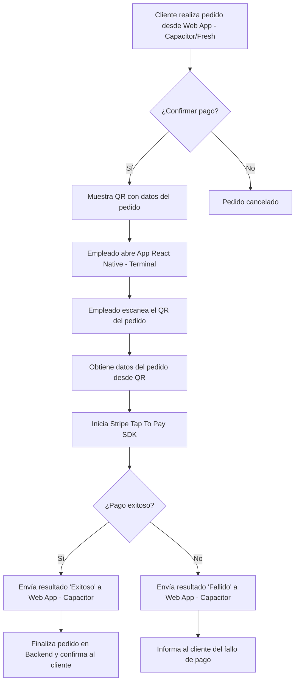

# 🟡 Development Cash Flow

```mermaid
flowchart TD
    A[Cliente realiza pedido desde Web App - Capacitor/Fresh] --> B{¿Confirmar pago?}
    B -- Sí --> C[Muestra QR con datos del pedido]
    C --> D[Empleado abre App React Native - Terminal]
    D --> E[Empleado escanea el QR del pedido]
    E --> F[Obtiene datos del pedido desde QR]
    F --> G[Inicia Stripe Tap To Pay SDK]
    G --> H{¿Pago exitoso?}
    H -- Sí --> I[Envía resultado 'Exitoso' a Web App - Capacitor]
    I --> J[Finaliza pedido en Backend y confirma al cliente]
    H -- No --> K[Envía resultado 'Fallido' a Web App - Capacitor]
    K --> L[Informa al cliente del fallo de pago]
    B -- No --> M[Pedido cancelado]

```