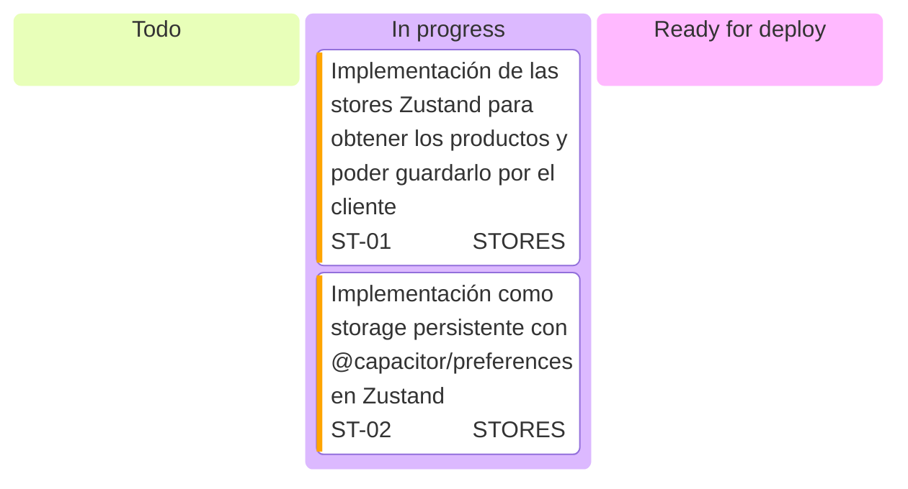
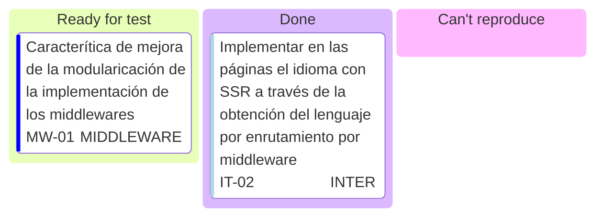
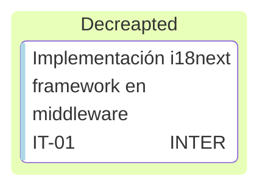

# Frontend App Progress

```mermaid
kanban
    [Todo]  
        
        
    [In progress]
        id2[Implementación de las stores Zustand para obtener los productos y poder guardarlo por el cliente]@{ ticket: 'ST-01', assigned: 'STORES', priority: 'High' }
        id3[Implementación como storage persistente con @capacitor/preferences en Zustand]@{ ticket: 'ST-02', assigned: 'STORES', priority: 'High' }
        
        
    [Ready for deploy]
        
```

```mermaid
kanban
    [Ready for test]
        id5[Caracterítica de mejora de la modularicación de la implementación de los middlewares]@{ ticket: 'MW-01', assigned: 'MIDDLEWARE', priority: 'Low' }
        
    [Done]
        id4[Implementar en las páginas el idioma con SSR a través de la obtención del lenguaje por enrutamiento por middleware]@{ ticket: 'IT-02', assigned: 'INTER', priority: 'Very Low' }
        
        

    [Can't reproduce]
        
```

```mermaid
kanban
    [Decreapted]
        id1[Implementación i18next framework en middleware]@{ ticket: 'IT-01', assigned: 'INTER', priority: 'Very Low' }
        
```