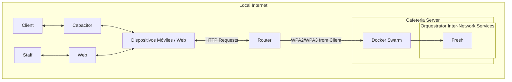
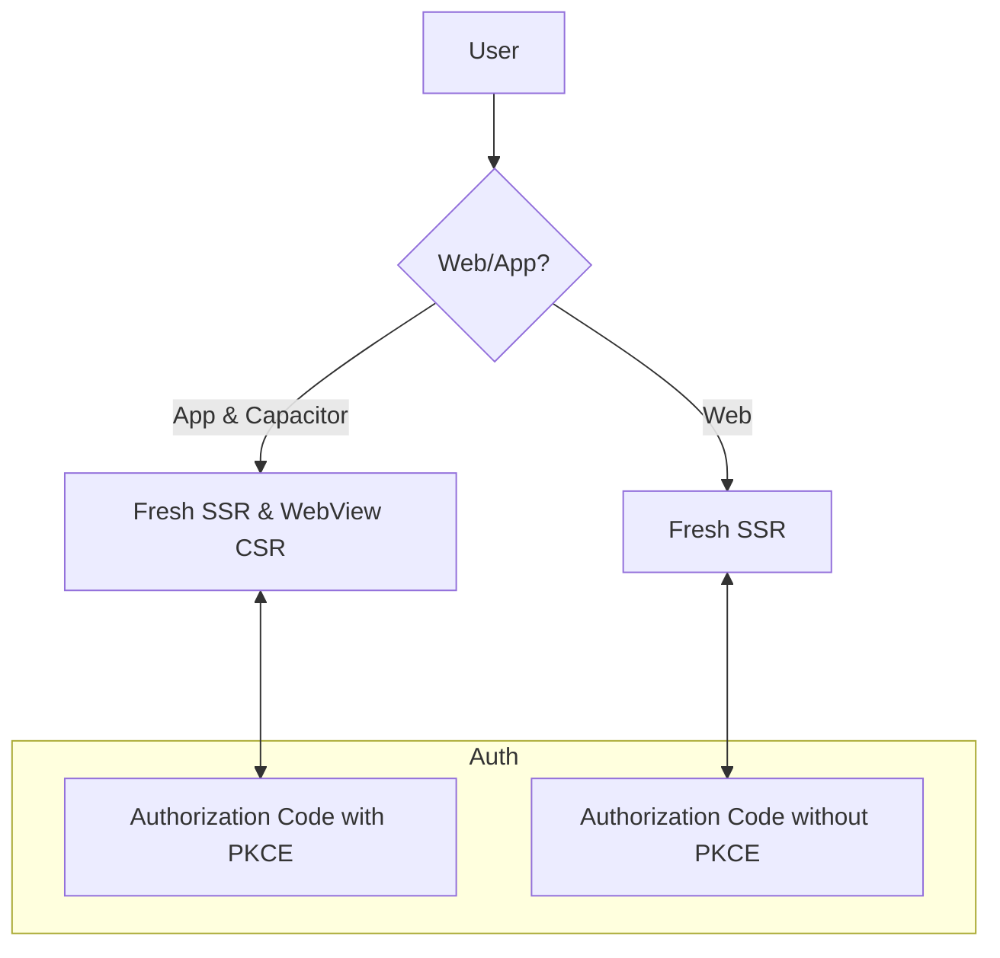

# 🟡 Frontend Flow

```mermaid
graph TD;
    subgraph Local Internet
        Staff
        EndUser[Client]
        Mobile
        Web

        EndUser <--> Mobile[Capacitor]
        Staff <--> Web

        Mobile <--> Dispositivos
        Web <--> Dispositivos


        Dispositivos[Dispositivos Móviles / Web] <-->|HTTP Requests| Router
        Router -->|WPA2/WPA3 from Client| Orquestador[Docker Swarm]
        
        subgraph Cafeteria Server
            
            subgraph Orquestrator Inter-Network Services
                Backend[Fresh]
            end
            Orquestador --> Backend
        end
        
    end
```

### Technical Flow

```mermaid
flowchart TB
    User
    TypeUser
    FreshMobile[Fresh SSR & WebView CSR]
    FreshWeb[Fresh SSR]

    subgraph Auth
        AuthMobile[Authorization Code with PKCE]
        AuthWeb[Authorization Code without PKCE]
    end

    User --> TypeUser{Web/App?}
    TypeUser -->|App & Capacitor| FreshMobile
    TypeUser -->|Web| FreshWeb

    FreshMobile <---> AuthMobile
    FreshWeb <---> AuthWeb
```