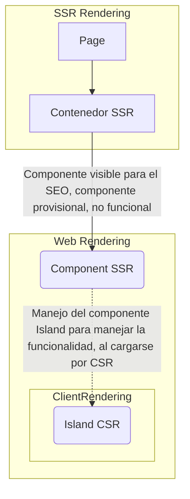

# 🟡 🔄 Frontend SEO

**Missing: Como por defecto el servicio es auto-hospedado y en entrono LAN, no se expone en el internet a través del DNS Privado (dominio) ni un DNS Público a través de los navegadores.**

En esta sección de la estructura del frontend hablaremos sobre estrategías para maximizar el SEO por web, las apps realmente no influye en la indexación, pero nos enfocaremos en que el frontend se llegue a **priorizar el SEO como en las app's como en las web's**.

## Frist SSR Component
A la hora de estcuturar los componentes deberemos de basarnos principalmente que debemos de presentar desde el servidor un componente SSR, si es que luego queremos cargar el componente CSR.

Me refiero, en Fresh, enrutamos coherentemente nuestros **componentes** con las rutas de las pages por directorios seprados. Seguidamente en el componente, renderizaríamos por así decirlo el subcomponente que entraría en la primera carga del servidor, y luego así si tenemos un island cargado remplazando el subcomponente y tendríamos el menejo del SEO optimizado a la primera carga priorizando completamente los componentes SSR antes que los CSR.

