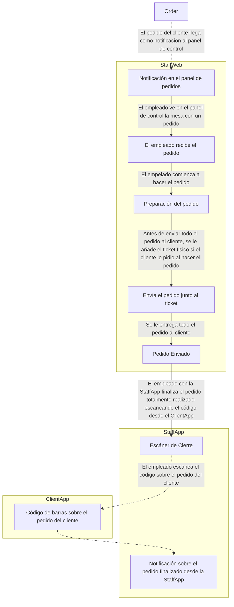

# Business Flow

```mermaid
flowchart TB
    Order
    
    

    subgraph StaffWeb
        Staff[El empleado recibe el pedido]
        PanelView[Notificación en el panel de pedidos]
        OrderCreation[Preparación del pedido]
        Ticket[Envía el pedido junto al ticket]
        OrderDelivered[Pedido Enviado]
    end
    subgraph StaffApp
        BarcodeScanner[Escáner de Cierre]
        StaffNotification[Notificación sobre el pedido finalizado desde la StaffApp]
    end
    subgraph ClientApp
        BarcodeOrder[Código de barras sobre el pedido del cliente ]
        
    end

    Order -.-> |El pedido del cliente llega como notificación al panel de control| PanelView
    PanelView --> |El empleado ve en el panel de control la mesa con un pedido| Staff
    Staff --> |El empelado comienza a hacer el pedido | OrderCreation
    OrderCreation ---> |Antes de enviar todo el pedido al cliente, se le añade el ticket fisico si el cliente lo pidio al hacer el pedido| Ticket
    Ticket --> |Se le entrega todo el pedido al cliente| OrderDelivered
    OrderDelivered --> |El empleado con la StaffApp finaliza el pedido totalmente realizado escaneando el código desde el ClientApp| BarcodeScanner
    BarcodeScanner -.-> |El empleado escanea el código sobre el pedido del cliente| BarcodeOrder
    
    BarcodeOrder -.-> StaffNotification
    

```
*Las flechas con puntos reflejan conexiónes asíncronas y procesos externos