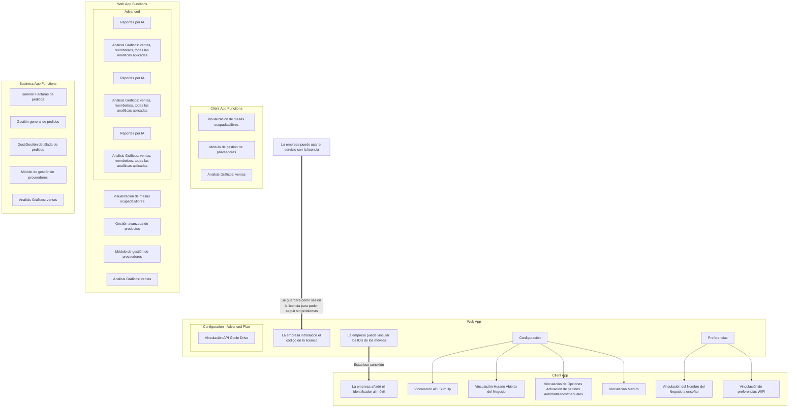

# 🟡 Business Functions relationated Configuration Flow

```mermaid
flowchart TB


    subgraph Web App
    direction TB
        BusinessEnterLicense[La empresa introducce el código de la licencia]
        BusinessLinkID[La empresa puede vincular los ID's de los móviles]
        subgraph Configuration - Advanced Plan
            BusinessLinkApiDrive[Vinculación API Goole Drive]
        end
        
        BusinessConfiguration[Configuración]
        BusinessPreferences[Preferencias]
    end
    subgraph Web App Functions
        BusinessWebAppFunTablesVisualize[Visualización de mesas ocupadas/libres]
        BusinessWebAppFunProductsAdvancedManager[Gestión avanzada de productos]
        BusinessWebAppFunSuppliers[Módulo de gestión de proveedores]
        BusinessWebAppFunAnalisis[Analisis Gráficos: ventas]
        subgraph Advanced
            BusinessWebAppFunAdvancedIAReports[Reportes por IA]
            BusinessWebAppFunAdvancedAnalisis[Analisis Gráficos: ventas, reembolsos, todas las analíticas aplicadas]
        end
    end

    subgraph Client App Functions
        BusinessClientAppFunTablesVisualize[Visualización de mesas ocupadas/libres]
        BusinessWebAppFunProductsAdvancedManager[Gestión avanzada de productos]
        BusinessClientAppFunSuppliers[Módulo de gestión de proveedores]
        BusinessClientAppFunAnalisis[Analisis Gráficos: ventas]
        subgraph Advanced
            BusinessClientAppFunAdvancedIAReports[Reportes por IA]
            BusinessClientAppFunAdvancedAnalisis[Analisis Gráficos: ventas, reembolsos, todas las analíticas aplicadas]
        end
    end

    subgraph Business App Functions
        BusinessAppFunPaymentManagment[Generar Facturas de pedidos]
        BusinessAppFunOrderGeneralManager[Gestión general de pedidos]
        BusinessAppFunOrderDetailedManager[GestiGestión detallada de pedidos]

        BusinessAppFunSuppliers[Módulo de gestión de proveedores]
        BusinessAppFunAnalisis[Analisis Gráficos: ventas]
        subgraph Advanced
            BusinessAppFunAdvancedIAReports[Reportes por IA]
            BusinessAppFunAdvancedAnalisis[Analisis Gráficos: ventas, reembolsos, todas las analíticas aplicadas]
        end
    end

    

    subgraph Client App
        direction TB
        ClientAppLinkBusinessID[La empresa añadé el identificador al móvil]
        ClientAppLinkApiKeySumUp[Vinculación API SumUp]
        ClientAppLinkDisplayName[Vinculación del Nombre del Negocio a enseñar]
        ClientAppLinkOpenSchedule[Vinculación Horario Abierto del Negocio]
        ClientAppLinkActivateOrderOptions[Vinculación de Opciones Activación de pedidos automatizados/manuales]
        ClientAppLinkWifiOptions[Vinculación de preferencias WIFI]
        ClientAppLinkMenus[Vinculación Menu's]
    end

    
    BusinessAccessLicense[La empresa puede usar el servicio con la licencia]
    
    BusinessAccessLicense ==> |Se guardará como sesión la licencia para poder seguir sin problemas| BusinessEnterLicense
    
    BusinessLinkID ==> |Establece conexión| ClientAppLinkBusinessID

    BusinessConfiguration --> ClientAppLinkApiKeySumUp
    BusinessConfiguration --> ClientAppLinkOpenSchedule
    BusinessConfiguration --> ClientAppLinkActivateOrderOptions
    BusinessConfiguration --> ClientAppLinkMenus
    BusinessPreferences --> ClientAppLinkDisplayName
    BusinessPreferences --> ClientAppLinkWifiOptions

    


```