# 🟡 🔄 Software Architecture
This document describes the software architecture based on the provided Mermaid graph. The system integrates various components like APIs, a backend, a database, and monitoring tools, orchestrated within a LAN network and interacting with external services. Below is an analysis of the architecture, its patterns, and characteristics.

### Architecture Overview
The system consists of:

- **External API Integration**: Interaction with a third-party service (SumUp API).
- **LAN Network**: A local network hosting mobile/web devices, a router, and a server.
- **Cafeteria Server**: A centralized server with orchestration, backend, database, and monitoring.
- **Personal PC**/**Auto-hosped & On-Premise server**: A separate monitoring stack with Prometheus and Grafana.

Mermaid Graph Representation, here’s the refined Mermaid graph for clarity:

```mermaid
graph TD;
    subgraph Internet
        subgraph API Supplier
            API_SUMUP[SumUp]
        end
        Personal_PC
    end
    API_SUMUP <--> |Obtain transaction inside of LAN Network from Internet: api.sumup.com| Router
    
    Backend --> |Send transaction: api.sumup.com| Router
    Router --> |Obtain verified transaction: api.sumup.com| Backend
    API_SUMUP
    subgraph Local Internet
        EndUser

        EndUser <--> Dispositivos
        Dispositivos[Dispositivos Móviles / Web] <-->|HTTP Requests| Router
        Router -->|WPA2/WPA3 from Client| Orquestador[Docker Swarm]
        
        subgraph Cafeteria Server
            Pipelight
            URI_DOCKER[unix://docker.sock]
            URI_DOCKER <--> Cadvisor
            
            subgraph Orquestrator Inter-Network Services
                Backend[Fresh]
                PostgreSQL
                Cadvisor
                KeyCloak
            end

            Orquestador --> PostgreSQL
            Orquestador --> Pipelight
            Backend[Fresh] --> |DB Queries| PostgreSQL
            Orquestador --> Backend
            Orquestador --> Cadvisor
            Backend <--> |Authorization Code with PKCE| KeyCloak
        end
        
    end
    subgraph Personal_PC[Personal PC]
        User[DevUser]
        User --> |Métricas sobre grafos :3000| Grafana
        User --> |SSH Conexion| Pipelight
        Prometheus <-->|Petición de Métricas :9095| Router
        Cadvisor <--> |Obtención de Métricas :9095| Router

        Prometheus --> Grafana
        Grafana --> |Petición de métricas :8080| Prometheus
    end
```

## Architectural Patterns by Component

### 1. Overall System
   - **Pattern**: Hybrid (Monolithic + Service-Oriented)
   - **Reasoning**:
     - The "Cafeteria Server" appears to be a single, tightly coupled unit (monolithic) hosting the Fresh backend, PostgreSQL, and cAdvisor, orchestrated together.
     - However, it integrates with an external service (SumUp API), suggesting a service-oriented approach where external dependencies are loosely coupled via APIs.
  - **Characteristics**:
    - Centralized deployment within the LAN.
    - External API calls indicate modularity but not full microservices.
### 2. Cafeteria Server
  - **Pattern**: Monolithic with Orchestration
  - **Reasoning**:
    - The Fresh backend, PostgreSQL database, and cAdvisor are housed together under an orchestrator, implying a single deployable unit.
    - The orchestrator (possibly Docker, Kubernetes, or a custom solution) manages these components, but they don’t appear as independent services with separate lifecycles, which rules out microservices.
  - **Characteristics**:
    - **Fresh Backend**: Handles business logic and API routing (likely RESTful).
    - **PostgreSQL**: Relational database for persistent storage, queried directly by the backend.
    - **cAdvisor**: Container monitoring, suggesting the server might use containers, but still within a monolithic structure.
    - Tight coupling between components, typical of a monolith.
### 3. API Supplier (SumUp Integration)
  - **Pattern**: Service-Oriented Architecture (SOA)
  - **Reasoning**:
    - The SumUp API is an external service accessed over the internet via the router.
    - Transactions are sent and received, indicating a request-response model rather than event-driven.
  - **Characteristics**:
    - Loose coupling with the LAN network.
    - Relies on HTTP/REST for communication.
    - No direct control over the API’s implementation.
### 4. LAN Network (Devices and Router)
- **Pattern**: Client-Server
- **Reasoning**:
  - Mobile/web devices act as clients sending HTTP requests to the router, which forwards them to the backend.
  - The router serves as a gateway, securing communication with WPA2/WPA3.
- **Characteristics**:
    - Simple request-response flow.
    - Centralized routing through the router, typical of client-server architectures.
### 5. Personal PC (Monitoring Stack)
  - **Pattern**: Event-Driven + Microservices-like
  - **Reasoning**:
    - cAdvisor pushes metrics to Prometheus, which stores and processes them, and Grafana pulls data for visualization.
    - This resembles an event-driven flow where metrics are emitted and consumed asynchronously.
    - Each component (cAdvisor, Prometheus, Grafana) operates independently, suggesting a microservices-like separation, though deployed on a single PC.

  - **Characteristics**:
    - **cAdvisor**: Generates metrics (event producer).
    - **Prometheus**: Time-series database (event consumer and processor).
    - **Grafana**: Visualization tool (consumer of processed data).
    - Loose coupling and scalability potential, though constrained to one machine.

## Detailed Breakdown of Patterns
### Monolithic Architecture
- **Where**: Cafeteria Server (Fresh, PostgreSQL, cAdvisor).
- **Pros**: Simpler deployment, easier debugging within the server.
- **Cons**: Limited scalability, single point of failure.
### Service-Oriented Architecture (SOA)
- **Where**: SumUp API integration.
- **Pros**: Reusability of external services, modularity.
- **Cons**: Dependency on external uptime and latency.
### Client-Server Architecture
- **Where**: LAN Network (Devices to Router to Backend).
- **Pros**: Clear separation of concerns, secure communication.
- **Cons**: Router as a bottleneck.
### Event-Driven Architecture
Where: Monitoring stack (cAdvisor → Prometheus → Grafana).
- **Pros**: Asynchronous, scalable for metrics collection.
- **Cons**: Complexity in ensuring data consistency.

### Microservices (Partial)**
- **Where**: Monitoring stack shows traits, but not fully distributed.
- **Pros**: Independent components.
- **Cons**: Not fully realized due to single-PC deployment.

## Data Flow
- **Transaction Flow**:
Mobile/web devices send HTTP requests to the router.
Router forwards requests to the Fresh backend.
Backend interacts with SumUp API via the router for transactions.
Verified transactions return to the backend and are stored in PostgreSQL.
- **Monitoring Flow**:
cAdvisor collects metrics from the Cafeteria Server.
Metrics are sent to Prometheus on the Personal PC.
Grafana visualizes the metrics for analysis.

## Conclusion
The architecture is a hybrid system:

- **Monolithic Core**: Cafeteria Server for simplicity and centralized control.
- **Service-Oriented Extensions**: Integration with SumUp API.
- **Event-Driven Monitoring**: Metrics pipeline for observability.
- **Client-Server Interaction**: Device-to-backend communication.

This design balances simplicity (monolith) with modularity (external APIs and monitoring), suitable for a small-scale system like a cafeteria, with room to evolve into microservices if scalability becomes a priority.

**Only partial, using microservices inside in only one node

---
#### Author: Adría Martín Martorell - 22 de marzo del 2025 - 3:44AM