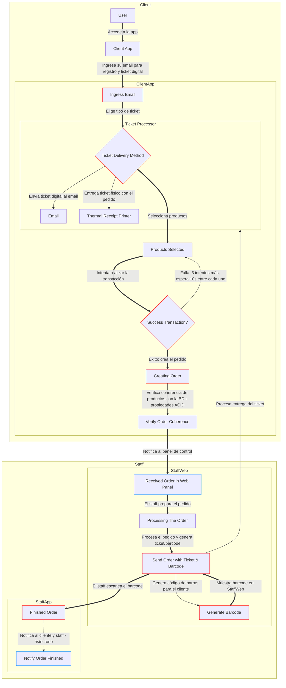

# 🟢 Software Flow

En esta sección se describe el flujo del software desde la perspectiva del cliente (consumidor final), que es la parte crítica del sistema, y del staff, que gestiona los pedidos. Este flujo asegura una experiencia intuitiva y un procesamiento eficiente.

Los nodos con **bordes rojos son críticos**: fallos en Email, Transaction, Order, Ticket o OrderFinished pueden colapsar el sistema.
Los nodos con **bordes azules son no críticos pero mejoran la experiencia**: TPV notifica al staff, GenerateBarcode y NotifyOrderFinished agilizan y completan el flujo.
Razones críticas: "Email" asegura identificación, "Transaction" valida pagos, "Order" crea el pedido, "Ticket" entrega comprobantes, "OrderFinished" cierra el flujo.

## ¿Por qué se completa el pedido con un código del staff?
Para resolver problemas de organización e identificación: el email se crea solo tras una transacción exitosa, y el pedido no se completa hasta que el staff escanea un código de barras único generado por el sistema.

### ¿Por qué este enfoque?
Para evitar que personas inmaduras o niños "trasteen" creando identificadores falsos, lo que podría saturar la base de datos con datos innecesarios o marcar pedidos ya realizados por error, empeorando el flujo.